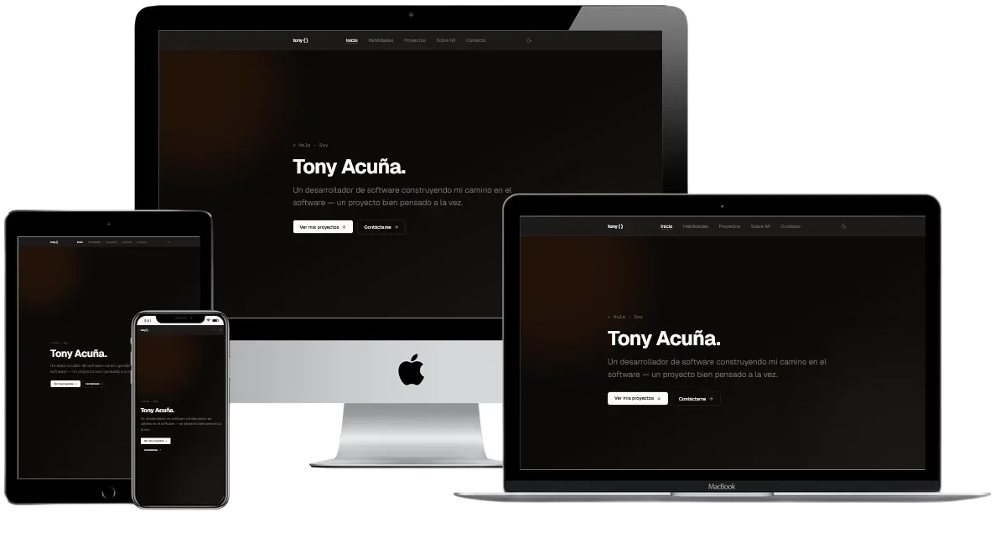

# Software Developer Portfolio

<p align="center">



</p>

A personal portfolio and project showcase built with **Next.js 16**, statically exported via **SSG**, and automatically deployed to **GitHub Pages** through **GitHub Actions**. Project case studies are authored in **MDX**, enabling rich, component-driven content alongside standard Markdown.

## ✨ Features

- **Static Site Generation** — The entire site is pre-rendered at build time into a fully static `out/` directory, requiring zero server infrastructure.
- **MDX-Powered Projects** — Each project is an `.mdx` file in `src/content/projects/`, combining Markdown prose with exported metadata and React components.
- **Dark / Light Theme** — Powered by `next-themes` with a class-based strategy and a custom warm stone-toned design system.
- **Scroll Animations** — Smooth, section-level entrance animations using `motion` (Framer Motion).
- **SEO First** — Automatic `robots.txt`, `sitemap.xml`, per-page Open Graph / Twitter cards, JSON-LD structured data (`WebSite`, `Person`, `Article`, `CollectionPage`), and canonical URLs.
- **Dynamic Favicons** — Programmatically generated `icon` and `apple-icon` via React components.
- **Tailwind CSS v4** — Styled with Tailwind v4 + `@tailwindcss/typography` for beautiful prose rendering inside project pages.
- **TypeScript** — Strict mode enabled throughout the codebase.

## 🏗️ Tech Stack

| Layer      | Technology                                                                                        |
| ---------- | ------------------------------------------------------------------------------------------------- |
| Framework  | [Next.js 16](https://nextjs.org/) (App Router)                                                    |
| Language   | [TypeScript](https://www.typescriptlang.org/)                                                     |
| UI         | [React 19](https://react.dev/)                                                                    |
| Styling    | [Tailwind CSS v4](https://tailwindcss.com/)                                                       |
| Content    | [MDX](https://mdxjs.com/) via `@next/mdx`                                                         |
| Animations | [Motion](https://motion.dev/) (Framer Motion)                                                     |
| Icons      | [Lucide React](https://lucide.dev/)                                                               |
| Theming    | [next-themes](https://github.com/pacocoursey/next-themes)                                         |
| Deployment | [GitHub Actions](https://github.com/features/actions) → [GitHub Pages](https://pages.github.com/) |

## 📁 Project Structure

```
portfolio/
├── .github/workflows/
│   └── deploy.yml              # CI/CD: build & deploy to GitHub Pages
├── public/
│   └── images/                 # Static assets (project screenshots, etc.)
├── src/
│   ├── app/
│   │   ├── layout.tsx          # Root layout (fonts, theme, navigation, footer)
│   │   ├── page.tsx            # Landing page (hero, skills, projects, about, contact)
│   │   ├── globals.css         # Design tokens & Tailwind config
│   │   ├── robots.ts           # Generated robots.txt
│   │   ├── sitemap.ts          # Generated sitemap.xml
│   │   └── projects/
│   │       ├── page.tsx        # /projects — project listing page
│   │       └── [slug]/
│   │           └── page.tsx    # /projects/:slug — individual project case study
│   ├── components/             # Reusable UI components (hero, nav, skills, etc.)
│   ├── content/
│   │   └── projects/           # MDX project files (one per project)
│   ├── context/                # React context providers
│   ├── interfaces/             # TypeScript type definitions
│   ├── lib/                    # Utilities (API helpers, SEO builder, constants)
│   └── resources/              # Site-wide content & configuration
├── mdx-components.tsx          # Global MDX component overrides
├── next.config.ts              # Next.js config (static export, MDX, base path)
├── tailwind.config.ts
├── tsconfig.json
└── package.json
```

## 🚀 Getting Started

### Prerequisites

- [Node.js](https://nodejs.org/) **v22+**
- [npm](https://www.npmjs.com/)

### Installation

```bash
git clone https://github.com/tony-97/portfolio.git
cd portfolio
npm install
```

### Development

```bash
npm run dev
```

The site will be available at [http://localhost:3000](http://localhost:3000).

### Production Build

```bash
npm run build
```

This generates a fully static site in the `out/` directory, ready for deployment to any static hosting provider.

## 🎨 Personalizing Your Portfolio

### 1. Personal Content — `src/resources/content.ts`

Update your name, role, email, social links, and page-level SEO copy:

```ts
export const person = {
  firstName: "Your First Name",
  lastName: "Your Last Name",
  name: "Your Full Name",
  role: "Your Role",
  email: "you@example.com",
  description: "A short bio about yourself.",
  socials: {
    github: "https://github.com/your-username",
    linkedin: "https://www.linkedin.com/in/your-profile",
  },
};
```

This file also exports `home` and `projects` objects that define the title, description, and Open Graph metadata for the landing page and project listing.

### 2. Skills & Sections — `src/lib/constants.tsx`

#### Skills

Edit the `skills` array to reflect your own tech stack. Each category has a name, icon, and list of items:

```tsx
export const skills = [
  {
    category: "Frontend",
    icon: <Layout className="w-5 h-5" />,
    items: [
      { name: "React.js", icon: <Blocks className="w-3.5 h-3.5" /> },
      // add or remove items...
    ],
  },
  // add or remove categories...
];
```

Icons are sourced from [Lucide React](https://lucide.dev/icons/) — browse the full catalog to find icons that match your skills.

#### Landing Page Sections

The `sections` array controls which components render on the landing page and in what order. Each entry maps to a component in `src/components/`:

```tsx
export const sections = defineSections([
  { id: "hero", label: "Home", component: HeroSection },
  {
    id: "skills",
    label: "Skills",
    component: SkillsSection,
    props: { skills },
  },
  { id: "projects", label: "Projects", component: ProjectsSection },
  { id: "about", label: "About Me", component: AboutSection },
  { id: "contact", label: "Contact", component: ContactSection },
]);
```

The `label` values are displayed in the navigation bar. Reorder, add, or remove entries to customize the page structure.

## 📝 Adding a New Project

1. Create a new `.mdx` file in `src/content/projects/`:

   ```
   src/content/projects/my-project.mdx
   ```

2. Export a `metadata` object at the top of the file:

   ```mdx
   export const metadata = {
     title: "My Project",
     description: "A brief description of the project.",
     goal: "What the project aims to achieve.",
     stack: ["React", "Node.js", "PostgreSQL"],
     challenge: "The main technical challenge and how it was solved.",
     github: "https://github.com/username/repo", // optional
     demo: "https://my-project.example.com", // optional
     publishedAt: new Date("2026-01-15"),
     lastModified: new Date("2026-01-20"),
     image: "/images/projects/my-project/cover.png",
   };

   ### Overview

   Write your project case study here using standard Markdown
   and any React components you need...
   ```

3. Place the project cover image in `public/images/projects/my-project/`.

4. The project will automatically appear on the landing page, the `/projects` listing, and get its own dedicated page at `/projects/my-project`.

## ⚙️ Static Export & GitHub Pages

### How It Works

The site uses Next.js [Static Exports](https://nextjs.org/docs/app/building-your-application/deploying/static-exports) (`output: "export"` in `next.config.ts`). At build time, every page is pre-rendered into static HTML/CSS/JS files inside the `out/` directory.

Key configuration in [`next.config.ts`](next.config.ts):

```ts
const nextConfig: NextConfig = {
  output: "export",
  basePath: process.env.PAGES_BASE_PATH,
  images: { unoptimized: true },
  pageExtensions: ["js", "jsx", "md", "mdx", "ts", "tsx"],
};
```

- **`output: "export"`** — Enables full static generation (no Node.js server required).
- **`basePath`** — Dynamically set by `actions/configure-pages` so asset paths resolve correctly on GitHub Pages (e.g., `/portfolio`).
- **`images: { unoptimized: true }`** — Required for static exports since Next.js Image Optimization needs a running server.

## 🗺️ Roadmap

- [ ] Add internationalization

## 📄 License

This project is open source and available for reference and inspiration.
